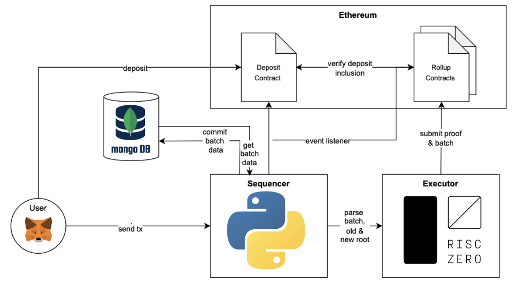

# ZK-Rollup Implementation

A zk-rollup system built for Ethereum. 
## Overview

This project implements a simple transfer-only ZK-rollup that addresses blockchain scalability by trading decentralization for throughput improvements

## Architecture

```text
zk-rollup/
├── anvil/                          # Local Ethereum simulation and testing environment
├── executor/                       # Rust-based ZK-SNARK proof generation and on-chain submission
├── frontend/                       # Frontend for creating TXs for the Rollup and deposit to the Sepolia Contract
├── lib/smt                         # our wrapper for smt libarary     
├── scripts/                        # Test data generation and utility scripts
├── sequencer/                      # Python-based transaction sequencing and batching logic
└── solidity/                       # Smart contracts and Foundry tests
    ├── contracts/                  # Rollup and deposit manager contracts
    ├── lib/                        # Dependencies (OpenZeppelin, Forge-std, RISC0)
    └── test/                       # Contract test suites
```

