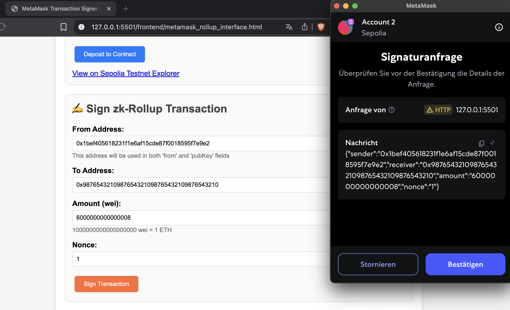

## Executor (RISC Zero Based)

The executor generates ZK-SNARK proofs for transaction batches using RISC Zero. There are two pre-generated batches in the data directory containing real MetaMask signatures from the frontend.



### Setup
```bash
export ETH_WALLET_PRIVATE_KEY=ac0974bec39a17e36ba4a6b4d238ff944bacb478cbed5efcae784d7bf4f2ff80
RISC0_USE_DOCKER=1 cargo build --release
```
Note: This only works on Linux x86. For other platforms, use Bonsai:
```bash
export BONSAI_API_URL=""
export BONSAI_API_KEY=""
```
### Running Batches

First batch:
```bash
RISC0_USE_DOCKER=1 cargo run --bin host -- \
  --chain-id 31337 \
  --rpc-url http://localhost:8545 \
  --contract 0x5FbDB2315678afecb367f032d93F642f64180aa3 \
  --eth-wallet-private-key ac0974bec39a17e36ba4a6b4d238ff944bacb478cbed5efcae784d7bf4f2ff80 \
  --batch-path host/data/first_sepolia_deposit_batch.json
```
Second batch:
```bash
RISC0_USE_DOCKER=1 cargo run --bin host -- \
  --chain-id 31337 \
  --rpc-url http://localhost:8545 \
  --contract 0x5FbDB2315678afecb367f032d93F642f64180aa3 \
  --eth-wallet-private-key ac0974bec39a17e36ba4a6b4d238ff944bacb478cbed5efcae784d7bf4f2ff80 \
  --batch-path host/data/second_sepolia_batch.json
```
